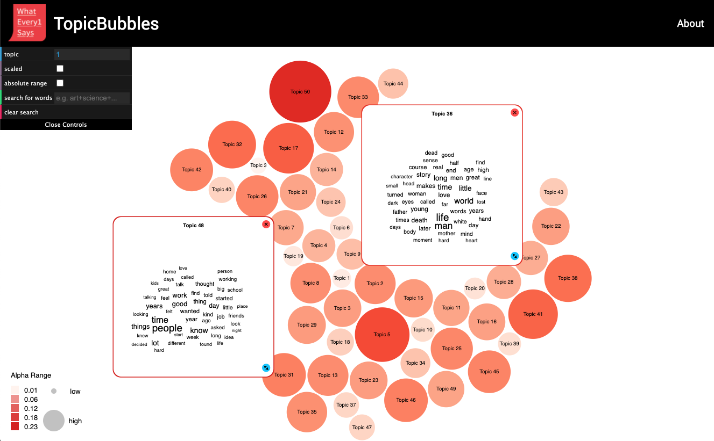

# Bubble Chart Visualization of Topic Models for the WE1S project

As a part of the [WhatEvery1Says project(WE1S)](https://we1s.ucsb.edu), this visualization project generates an interactive bubble chart of topic models by using [D3.js](https://d3js.org/). Based on the experience gained from the use of  [the dfr-browser](https://agoldst.github.io/dfr-browser/), a simple topic model browser, it aims to present more intuitve and interative topic model visualization.

Here is [an example link](https://sihwapark.github.io/topic-bubbles/) to see how it works.

## How to Use

Basically, it visualizes topic model data that the R package [dfrtopics](https://github.com/agoldst/dfrtopics) creates. To see a visualization result, it requires to create the model data first. Please see [the dfr-browser](https://agoldst.github.io/dfr-browser/) to know how to generate the model data in detail. 

After having the model data, put below files inside `data` folder:

- dt.json.zip
- info.json
- meta.csv.zip
- topic_scaled.csv
- tw.json

## Visualization

### Bubbles

Each bubble represents a topic and its size and color are determined by `alpha` in `tw.json`, the hyper parameter alpha for each topic, which indicates how many times each topic appears in the document. The bigger and redder a circle is, the higher an alpha value is. And it maps `alpha ` to size and color in two ways: Absolute and relative range mapping.

- Absolute range mapping
  - In this mapping,  a range for  `alpha`vaues is fixed with [0, 1] and this range is mapped into a size in the range [20, 80] with the use of `d3.scaleSqrt()`.
  - For the color mapping,  it uses the 'Reds' sequential color scheme `d3.interpolateReds` with the range [0, 0.7] not to make too dark red color.
- Relative range mapping
  - The alpha range depends on real data values by finding the maximum and minimum alpha value from the data.
  - Mapped ranges for color and size and a scaling function are the same with the absolute range mapping.

Through the selection of the 'absolute range' checkbox in the GUI at the top-right corne, it is possible to change a mapping mode.

When a bubble is clicked, it expands its size morphing into a big rounded square and reveals words of each topic as a form of word clouds.

### Word Cloud

Word clouds represent words of a topic by varying a font size according to a ratio of each word's weight to the maximum weight among words in the topic. A ratio of each word, ranging from 0 to 1, is mapped into a font size in the range [5, 25], with the use of `d3.scaleSqrt()`.

A layout of word clouds in a square is automatically caculated by Jason Davies's library, [d3-cloud](https://github.com/jasondavies/d3-cloud).

### Scaled View

As [the dfr-browser](https://agoldst.github.io/dfr-browser/) shows a scaled view of topic models, it also re-plots topic bubbles according to values in `topic_scaled.csv` when the 'scaled' checkbox in the GUI is selected.

### Force Simulation

A force simulation with the use of `d3.forceSimulation` is applied in the background and controls toppic bubbles' position/motion/collision, giving a force toward a center of the screen.

## Libraries and Reference

### Used Libraries

- [dat.GUI](https://github.com/dataarts/dat.gui)
- [d3-scale-chromatic](https://github.com/d3/d3-scale-chromatic) 
- [d3-legend](http://d3-legend.susielu.com/)
- [d3-cloud](https://github.com/jasondavies/d3-cloud)
  - [An example](https://bl.ocks.org/abrahamdu/e1481e86dd4e9d553cc2d7d359b91e68) for d3.js v4 or above
- [fetch](https://github.com/github/fetch) to support `fetch()` in IE
- [polyfill](https://github.com/taylorhakes/promise-polyfill), a Promise polyfill for older browsers

### Reference

- [Interactive bubble chart example by Nau Studio]( https://naustud.io/tech-stack/) 
